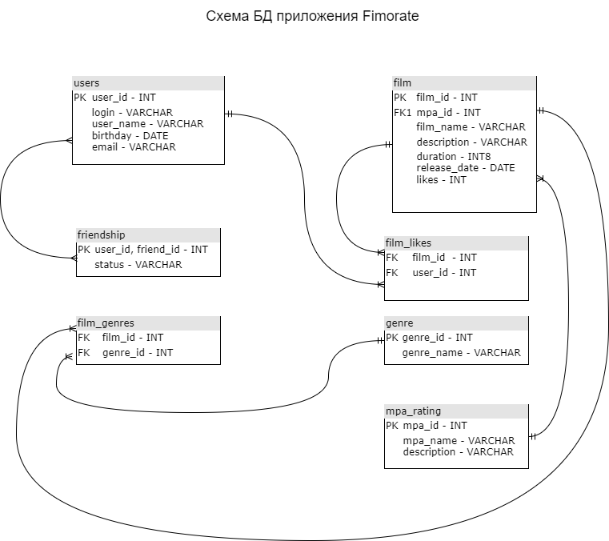

# Схема БД приложения Filmorate

# Описание таблиц:

## users - содержит данные о пользователях

* **user_id** - индентификатор пользователя, первичный ключ
* **login** - логин пользователя
* **user_name** - имя пользователя
* **birthday** - день рождения пользователя
* **email** - адрес почты пользователя

## friendship - сосдержит данные о статусах добавления в друзья

* **(user_id, friend_id)** - индентификаторы пользователя, составной первичный ключ (формируется из двух уникальных user_id из таблицы Users)
* **status** - статус добавления в друзья (UNCONFIRMED, CONFIRMED)

## genre - содержит данные о жанрах фильмов

* **genre_id** - идентификатор жанра фильма, первичный ключ
* **genre_name** - название жанра фильма

## film - содержит данные о фильмах

* **film_id** - идентификатор фильма, первичный ключ
* **genre_id** - идентификатор жанра фильма, внешний ключ
* **film_name** - название фильма
* **description** - краткое описание фильма
* **release_date** - дата премьеры фильма
* **duration** - продолжительность фильма
* **mpa_id** - возрастной рейтинг.

## film_likes - содержит данные о пользовательском рейтинге фильма

* **user_id** - id пользователя, поставившего лайк. Внешний ключ 
* **film_id** - id фильма. Внешний ключ
* **likes** - количество лайков пользователей

## mpa_rating - содержит данные о возрастном рейтинге фильма (Ассоциации кинокомпаний - англ. Motion Picture Association, сокращённо МРА)

* **mpa_id** - идентификатор рейтинга. Первичный ключ
* **mpa_name** - код рейтинга
* **description** - описание кода рейтинга

## Пример запросов к БД

* **Наполнение таблицы Users**

  INSERT INTO users VALUES ('1','ser', 'sergey', 'sergeev', '1990-01-01', 'sergey@mail.ru');
  
  INSERT INTO users VALUES ('2','pet', 'petr', 'petrov', '1990-02-01', 'petr@mail.ru');

* **Выводим данные конкретного пользователя**
  
  SELECT login, first_name, last_name, email FROM users WHERE user_id = '1';

* **Наполнение таблицы friendship**

    INSERT INTO friendship VALUES ('1', '2', 'UNCONFIRMED');

    INSERT INTO friendship VALUES ('2', '1', 'UNCONFIRMED');

* **Изменение статуса запроса в друзья**

    UPDATE friendship SET status = 'CONFIRMED' WHERE user_id = '1' AND friend_id = '2';

* **Проверка изменения статуса запроса в друзья**

    SELECT user_id, friend_id, status FROM friendship WHERE user_id = '1' AND friend_id = '2';

* **Наполнение таблицы Genre**

    INSERT INTO genre VALUES ('2', 'DRAMA');

    INSERT INTO genre VALUES ('3', 'CARTOON');

    INSERT INTO genre VALUES ('4', 'THRILLER');

    INSERT INTO genre VALUES ('5', 'DOCUMENTARY');

    INSERT INTO genre VALUES ('6', 'ACTION');

* **Проверка добавления жанров в таблицу**

    SELECT * FROM genre;

* **Наполнение таблицы film**

INSERT INTO film VALUES ('1', '1', 'Kino 1', 'Horoshee kino', '2022-01-01', '120', 'G');

* **Вывод информации о фильме**

    SELECT f.name, f.description, g.name FROM film AS f LEFT OUTER JOIN genre AS g ON f.film_id = '1' LIMIT 1;

* **Наполнение таблицы rating**

    INSERT INTO rating VALUES ('1', '1', '0');

* **Вывод информации о рейтинге фильма**

    SELECT r.user_id, r.film_id, r.rate FROM rating AS r;