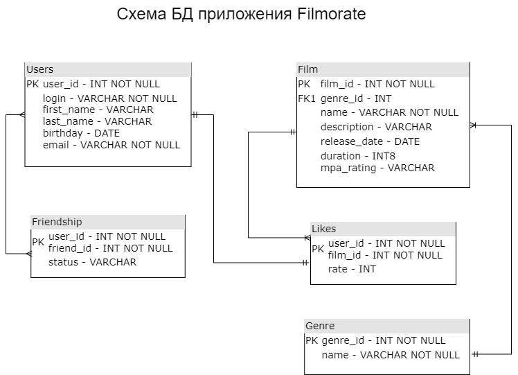

# Схема БД приложения Filmorate

# Описание таблиц:

## users - содержит данные о пользователях

* **user_id** - индентификатор пользователя, первичный ключ
* **login** - логин пользователя
* **user_name** - имя пользователя
* **birthday** - день рождения пользователя
* **email** - адрес почты пользователя

## friendship - сосдержит данные о статусах добавления в друзья

* **(user_id, friend_id)** - индентификаторы пользователя, составной первичный ключ (формируется из двух уникальных user_id из таблицы Users)
* **status** - статус добавления в друзья (UNCONFIRMED, CONFIRMED)

## genre - содержит данные о жанрах фильмов

* **genre_id** - идентификатор жанра фильма, первичный ключ
* **genre_name** - название жанра фильма

## film_genres - содержит данные, к какому жанру отосится фильм

* **film_id** - идентификатор жанра фильма, внешний ключ
* **genre_id** - идентификатор жанра фильма, внешний ключ

## film - содержит данные о фильмах

* **film_id** - идентификатор фильма, первичный ключ
* **genre_id** - идентификатор жанра фильма, внешний ключ
* **film_name** - название фильма
* **description** - краткое описание фильма
* **release_date** - дата премьеры фильма
* **duration** - продолжительность фильма
* **mpa_id** - возрастной рейтинг.
* **likes** - количество лайков пользователей

## film_likes - содержит данные о пользовательском рейтинге фильма

* **user_id** - идентификатор пользователя, поставившего лайк. Внешний ключ 
* **film_id** - идентификатор фильма. Внешний ключ

## mpa_rating - содержит данные о возрастном рейтинге фильма (Ассоциации кинокомпаний - англ. Motion Picture Association, сокращённо МРА)

* **mpa_id** - идентификатор рейтинга. Первичный ключ
* **mpa_name** - код рейтинга
* **description** - описание кода рейтинга

## Пример запросов к БД

* **Вывод информации о первых 10 пользователях**

    SELECT login, user_name, birthday, email
    FROM users
    LIMIT 10;

* **Получить 10 лучших фильмов**

    SELECT f.film_name, f.description, f.likes
    FROM film AS f
    GROUP BY f.film_name, f.description, f.likes
    ORDER BY f.likes DESC
    LIMIT 10;

* **Получить общих друзей**
  
    SELECT user_id, friend_id
    FROM friendship
    WHERE friend_id = '1' AND status = 'CONFIRMED';

* **Вывод информации о фильме. Сортировка по лайкам в порядке убывания**

    SELECT f.film_name, f.description, g.genre_name, mpa.mpa_name, f.duration, f.release_date, f.likes
    FROM film AS f
    LEFT OUTER JOIN genre AS g ON f.genre_id = g.genre_id
    LEFT OUTER JOIN mpa_rating AS mpa ON f.mpa_id = mpa.mpa_id
    GROUP BY f.film_name, f.description, g.genre_name, mpa.mpa_name, f.duration, f.release_date, f.likes
    ORDER BY f.likes DESC;

* **Вывод всей информации о первых 10 фильмах**

    SELECT *
    FROM film
    LIMIT 10;